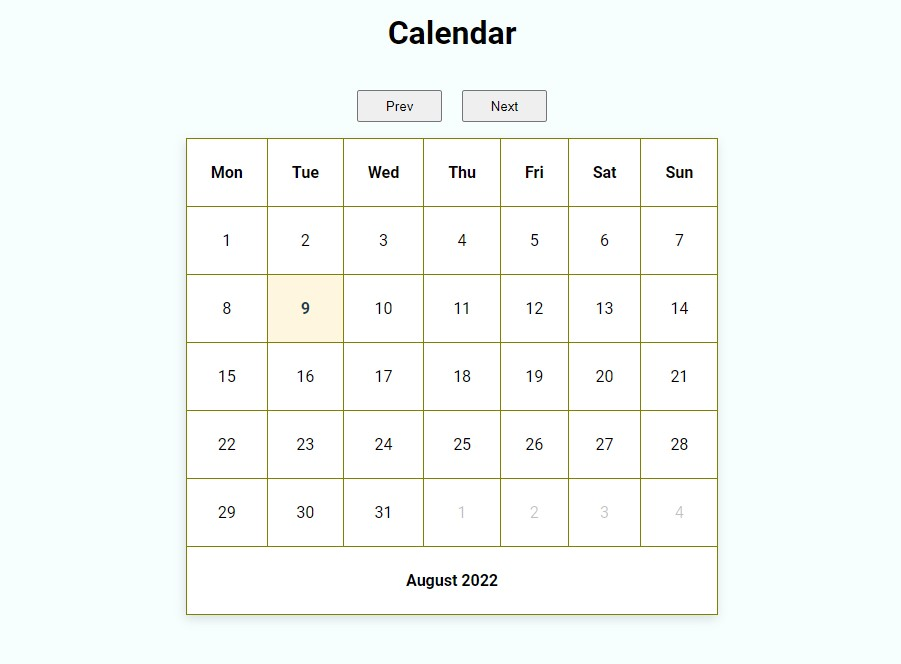

# Calendar application
[RUN APPLICATION](https://dmitrykolotilshikov.github.io/calendar)


## Calendar application

```
    Calendar application (HTML | CSS | JavaScript)
    functional programming.
```
```
  Functionality:
   • Switching months
   • Smart date selection
   • Highlight today's date
   • Display active month and year
   • Displaying the dates of the next and previous months
```

## Calendar приложение

```
    Приложение написано на (HTML | CSS | JavaScript)
    Функциональный подход
```

```
  Функциональность:
   • Переключение месяцев
   • Умное выделение дат
   • Подсветка сегодняшней даты
   • Отображение активного месяца и года
   • Отображение дат следующего и предыдущего месяцев
```



---
© [Dmitry Kolotilshikov](https://github.com/DmitryKolotilshikov)
